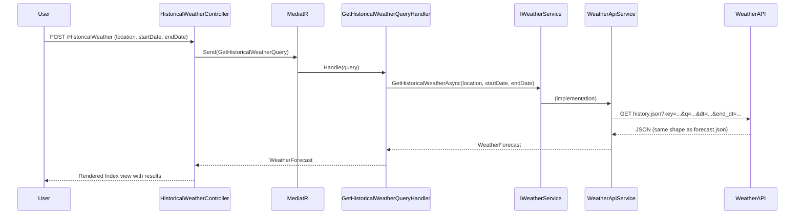

# Technical Design Specification

## Architecture Overview

Solution is ASP.NET Core 10 using Clean/Domain-Driven Design Architecture with 4 projects: Domain, Application, Infrastructure, and Web (MVC).

```
WeatherApp.Domain
    └── Entities: WeatherForecast, WeatherForecastDay (reused, unchanged)
    └── Interfaces: IWeatherService (extended with GetHistoricalWeatherAsync)

WeatherApp.Application
    └── Weather/Queries: GetHistoricalWeatherQuery, GetHistoricalWeatherQueryHandler (new)

WeatherApp.Infrastructure
    └── Services: WeatherApiService (extended with GetHistoricalWeatherAsync)
    └── Models: WeatherForecastApiResponse (reused, unchanged)

WeatherApp.Web (MVC)
    └── Controllers: HistoricalWeatherController (new)
    └── Views/HistoricalWeather/Index.cshtml (new)
    └── Views/Shared/_Layout.cshtml (nav link added)
```

The dependency flow remains strictly unidirectional: Domain ← Application ← Infrastructure ← Web.
No new domain entities are introduced; the feature reuses `WeatherForecast` and `WeatherForecastDay`.
Configuration (API key, base URL) continues to be sourced from `appsettings.json` via `IConfiguration`.

---

## Component Changes

| Component | Action | Notes |
|---|---|---|
| `WeatherForecast` | Reused | No changes |
| `WeatherForecastDay` | Reused | No changes |
| `IWeatherService` | Extended | Add `GetHistoricalWeatherAsync` |
| `WeatherForecastApiResponse` | Reused | history.json returns identical JSON shape to forecast.json |
| `WeatherApiService` | Extended | Implement `GetHistoricalWeatherAsync` |
| `GetHistoricalWeatherQuery` | New | MediatR query record |
| `GetHistoricalWeatherQueryHandler` | New | MediatR handler |
| `HistoricalWeatherController` | New | MVC controller |
| `Views/HistoricalWeather/Index.cshtml` | New | Form + results view |
| `Views/Shared/_Layout.cshtml` | Modified | Add nav link |

---

## Domain Layer

### Entities (reused, no changes)

```csharp
// WeatherApp.Domain/Entities/WeatherForecast.cs
public class WeatherForecast
{
    public string Location { get; set; } = string.Empty;
    public List<WeatherForecastDay> Days { get; set; } = [];
}

// WeatherApp.Domain/Entities/WeatherForecastDay.cs
public class WeatherForecastDay
{
    public DateOnly Date { get; set; }
    public double MaxTempC { get; set; }
    public double MinTempC { get; set; }
    public string Description { get; set; } = string.Empty;
}
```

### Interface (extended)

Add one method to `IWeatherService`:

```csharp
// WeatherApp.Domain/Interfaces/IWeatherService.cs
Task<WeatherForecast> GetHistoricalWeatherAsync(string location, DateOnly startDate, DateOnly endDate);
```

The method signature mirrors `GetWeatherForecastAsync` but accepts an explicit date range. Returning `WeatherForecast` keeps the domain model consistent — the caller receives the same shape regardless of whether data is forecast or historical.

---

## Application Layer

### Query

```csharp
// WeatherApp.Application/Weather/Queries/GetHistoricalWeatherQuery.cs
public record GetHistoricalWeatherQuery(string Location, DateOnly StartDate, DateOnly EndDate)
    : IRequest<WeatherForecast>;
```

Using a `record` matches the existing `GetWeatherForecastQuery` pattern and provides value-based equality for free.

### Handler

```csharp
// WeatherApp.Application/Weather/Queries/GetHistoricalWeatherQueryHandler.cs
public class GetHistoricalWeatherQueryHandler
    : IRequestHandler<GetHistoricalWeatherQuery, WeatherForecast>
{
    private readonly IWeatherService _weatherService;

    public GetHistoricalWeatherQueryHandler(IWeatherService weatherService)
        => _weatherService = weatherService;

    public Task<WeatherForecast> Handle(
        GetHistoricalWeatherQuery request,
        CancellationToken cancellationToken)
        => _weatherService.GetHistoricalWeatherAsync(
            request.Location, request.StartDate, request.EndDate);
}
```

The handler is intentionally thin — it delegates directly to the domain service, consistent with the existing handlers.

---

## Infrastructure Layer

### WeatherApiService (extended)

The WeatherAPI `history.json` endpoint accepts `dt` (start date) and `end_dt` (end date) and returns the same JSON structure as `forecast.json`. `WeatherForecastApiResponse` can therefore be reused without modification.

```csharp
// New method added to WeatherApiService
public async Task<WeatherForecast> GetHistoricalWeatherAsync(
    string location, DateOnly startDate, DateOnly endDate)
{
    var url = $"history.json?key={_apiKey}" +
              $"&q={Uri.EscapeDataString(location)}" +
              $"&dt={startDate:yyyy-MM-dd}" +
              $"&end_dt={endDate:yyyy-MM-dd}";

    var response = await _httpClient.GetAsync(url);
    response.EnsureSuccessStatusCode();

    var content = await response.Content.ReadAsStringAsync();
    var historyData = JsonSerializer.Deserialize<WeatherForecastApiResponse>(content);

    if (historyData?.Location == null || historyData.Forecast == null)
        throw new InvalidOperationException("Invalid response from historical weather API");

    var days = historyData.Forecast.ForecastDay.Select(d => new WeatherForecastDay
    {
        Date = DateOnly.Parse(d.Date),
        MaxTempC = d.Day?.MaxTempC ?? 0,
        MinTempC = d.Day?.MinTempC ?? 0,
        Description = d.Day?.Condition?.Text ?? "Unknown"
    }).ToList();

    return new WeatherForecast
    {
        Location = historyData.Location.Name,
        Days = days
    };
}
```

Date values are formatted as `yyyy-MM-dd` to match the WeatherAPI specification.

### Infrastructure Models (reused, no changes)

`WeatherForecastApiResponse`, `ForecastData`, `ForecastDayData`, `DayData`, `ConditionData`, and `LocationData` are all reused as-is.

---

## Web / UI Layer

### HistoricalWeatherController

```csharp
// WeatherApp.Web/Controllers/HistoricalWeatherController.cs
public class HistoricalWeatherController : Controller
{
    private readonly IMediator _mediator;

    public HistoricalWeatherController(IMediator mediator) => _mediator = mediator;

    [HttpGet]
    public IActionResult Index() => View();

    [HttpPost]
    public async Task<IActionResult> Index(
        string location, DateOnly startDate, DateOnly endDate)
    {
        var query = new GetHistoricalWeatherQuery(location, startDate, endDate);
        var result = await _mediator.Send(query);
        return View(result);
    }
}
```

### View — Views/HistoricalWeather/Index.cshtml

The view renders a form on GET and displays results on POST. It follows the Bootstrap + semantic HTML pattern used by the existing forecast view.

Key accessibility requirements:
- All `<input>` elements have associated `<label>` elements (explicit `for`/`id` pairing).
- The submit button has a descriptive label.
- Results table uses `<thead>` / `<tbody>` with `scope="col"` on header cells.
- Form validation errors are surfaced via `<span asp-validation-for>` with `role="alert"`.

### Navigation — Views/Shared/_Layout.cshtml

Add a nav link alongside the existing forecast link:

```html
<li class="nav-item">
    <a class="nav-link" asp-controller="HistoricalWeather" asp-action="Index">Historical Weather</a>
</li>
```

---

## Data Flow Diagram



---

## Correctness Properties

*A property is a characteristic or behavior that should hold true across all valid executions of a system — essentially, a formal statement about what the system should do. Properties serve as the bridge between human-readable specifications and machine-verifiable correctness guarantees.*

### Property 1: Historical query result contains the requested location

*For any* valid location string and date range, when `GetHistoricalWeatherQueryHandler` handles a `GetHistoricalWeatherQuery`, the returned `WeatherForecast.Location` should be non-empty and correspond to the queried location.

**Validates: Requirements Condition C**

### Property 2: Historical query result days fall within the requested date range

*For any* valid location and date range `[startDate, endDate]`, every `WeatherForecastDay.Date` in the returned `WeatherForecast.Days` should satisfy `startDate <= day.Date <= endDate`.

**Validates: Requirements Condition C**

### Property 3: View renders all forecast days

*For any* `WeatherForecast` model with N days, the rendered `Index.cshtml` output should contain exactly N rows of weather data (one per `WeatherForecastDay`), each including the date, max temperature, min temperature, and description.

**Validates: Requirements Condition C**

---

## Error Handling

| Scenario | Handling |
|---|---|
| WeatherAPI returns non-2xx | `EnsureSuccessStatusCode()` throws `HttpRequestException`; controller returns error view |
| API response body is null/malformed | `InvalidOperationException` thrown in `WeatherApiService`; controller catches and returns error view |
| `startDate` after `endDate` | Validated in controller before dispatching query; model error returned to view |
| Empty location string | Validated via `[Required]` model binding; form re-displayed with validation message |
| API key missing from config | `ArgumentNullException` thrown at service construction (startup fails fast) |

---

## Testing Strategy

### Dual Testing Approach

Both unit tests and property-based tests are required. Unit tests cover specific examples, integration points, and error conditions. Property-based tests verify universal properties across randomised inputs.

### Unit Tests (xUnit + Moq + FluentAssertions)

**WeatherApp.Application.Tests**
- `GetHistoricalWeatherQueryHandlerTests`
  - `Handle_ValidQuery_ReturnsWeatherForecast` — mock `IWeatherService`, assert result is forwarded correctly.
  - `Handle_ServiceThrows_PropagatesException` — verify exceptions bubble up.

**WeatherApp.Infrastructure.Tests**
- `WeatherApiServiceHistoricalTests`
  - `GetHistoricalWeatherAsync_ValidResponse_MapsCorrectly` — mock `HttpClient` with a valid JSON fixture, assert mapping.
  - `GetHistoricalWeatherAsync_NullLocation_ThrowsInvalidOperationException`
  - `GetHistoricalWeatherAsync_HttpError_ThrowsHttpRequestException`

**WeatherApp.Web.Tests**
- `HistoricalWeatherControllerTests`
  - `Index_Get_ReturnsViewResult`
  - `Index_Post_ValidInput_ReturnsViewWithModel`
  - `Index_Post_StartDateAfterEndDate_ReturnsViewWithModelError`
  - `Index_Post_EmptyLocation_ReturnsViewWithModelError`

### Property-Based Tests (xUnit + FsCheck or CsCheck, minimum 100 iterations each)

Each property test must be tagged with a comment in the format:
`// Feature: historical-weather, Property {N}: {property_text}`

**Property 1 test** — `GetHistoricalWeatherQueryHandler_LocationIsPreserved`
Generate random non-empty location strings and date ranges. Assert `result.Location` is non-empty.
`// Feature: historical-weather, Property 1: Historical query result contains the requested location`

**Property 2 test** — `WeatherApiService_DaysWithinDateRange`
Generate random date ranges and mock API responses with days inside and outside the range. Assert all returned days satisfy `startDate <= day.Date <= endDate`.
`// Feature: historical-weather, Property 2: Historical query result days fall within the requested date range`

**Property 3 test** — `HistoricalWeatherView_RendersAllDays`
Generate random `WeatherForecast` instances with N days (N ∈ [0, 30]). Render the view and assert exactly N data rows appear.
`// Feature: historical-weather, Property 3: View renders all forecast days`
